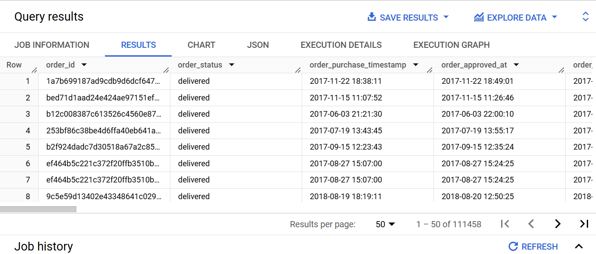
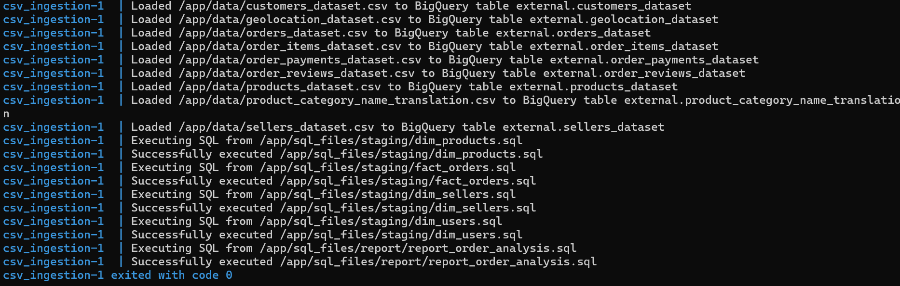

Here is a simple `README.md` file for your project:

---

# CSV to BigQuery Ingestion Pipeline

This project provides a simple ingestion pipeline that uploads CSV files to Google BigQuery, using Python and Docker. It is designed for quick setup and deployment, with future enhancements planned for advanced orchestration and data transformations.

## Overview

The current pipeline performs the following steps:
1. Reads CSV files from the specified directory.
2. Uploads data to BigQuery tables, automatically appending new data.
3. Uses Docker to containerize the Python environment for consistent deployment.

## Getting Started

### Prerequisites

- Docker and Docker Compose
- Google Cloud BigQuery setup with appropriate credentials
- A service account JSON key with permissions for BigQuery (set `GOOGLE_APPLICATION_CREDENTIALS` environment variable)

### Setup

1. Clone this repository:
   ```bash
   git clone https://github.com/your-repo/simple_ingestion.git
   cd simple_ingestion
   ```

2. Place your CSV files in the `/data` directory.

3. Update environment variables in `.env`:
   - `PROJECT_ID`: Your Google Cloud Project ID
   - `DATASET_ID`: The BigQuery Dataset where tables will be created
   - `GOOGLE_APPLICATION_CREDENTIALS`: Path to your BigQuery service account key file

### Running the Pipeline

1. Build and run the Docker container with Docker Compose:
   ```bash
   docker compose up --build
   ```

   This command will:
   - Build the Docker image for the Python environment
   - Run the `ingest_to_bigquery.py` script to load CSV data into BigQuery

## Project Structure

```plaintext
simple_ingestion/
├── Dockerfile                 # Defines the Docker image
├── docker-compose.yml         # Docker Compose file for multi-container deployment
├── ingest_to_bigquery.py      # Python script for CSV to BigQuery ingestion
├── staging_process.py         # Python script for staging transformations (future)
├── requirements.txt           # Python dependencies
├── data/                      # Directory for storing CSV files
└── .env                       # Environment variable configurations
```

## Future Enhancements

The following enhancements are planned for this project:

1. **Orchestration Tools**: Implement orchestration tools like Apache Airflow to manage, schedule, and monitor the pipeline.
2. **Data Build Tool (DBT)**: Use DBT to create modular, versioned transformations for each data layer (staging and reporting) in BigQuery, making it easier to manage and version data transformations.

---

## Result



